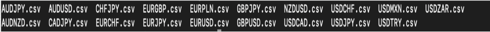

## GENERAL INFORMATION
- Add information about the project

## SETTING UP THE DATA

1) Download archive.zip file containing all the data [here](https://www.kaggle.com/datasets/joseserrat/forex-tick-data-huge-database-part-2).
2) Copy and paste (with `scp`) the .zip file into your working directory of your remote computer.
3) Unzip the file with `unzip archive.zip`. Now you should have 13 folders containing data for each month for respective 19 currency pairs.
4) Remove the archive file with `rm archive.zip`.
5) Move all the monthly folders into one folder called `data`.
6) Clone all the scripts with `git clone github:....`.
7) Run `sbatch submitCE.sh` to parallelly collect all data of each currency pair into one csv file. All these csv files will be saved in directory named `allExchanges`.

You should have the following csv files in your `allExchanges` directory:

These 19 csv files are the ones that will be used in 19 parallel jobs to do our statistical analysis.
